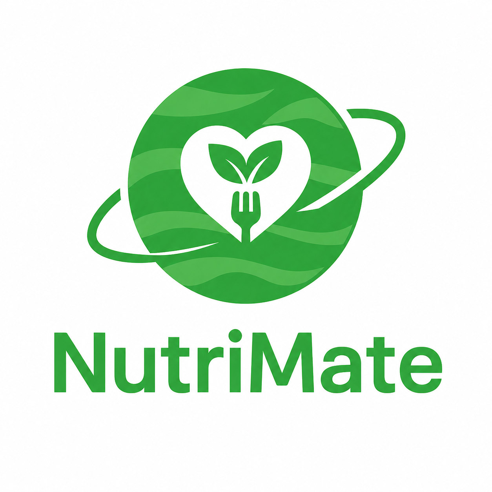

<p align="center">
  
</p>

<h1 align="center">NutriMate</h1>

<p align="center">
  <strong>Personal Food Recommendation System</strong>
</p>

<p align="center">
  Aplikasi berbasis web untuk memberikan rekomendasi makanan personal berdasarkan kebutuhan energi dan preferensi pengguna.
</p>

<p align="center">
  
  
  
  
</p>

---


## 🍽️ About NutriMate

**NutriMate** adalah aplikasi berbasis web yang dirancang untuk membantu pengguna mendapatkan rekomendasi makanan berdasarkan kondisi dan preferensi pribadi.

Sistem tidak hanya mempertimbangkan makanan yang disukai pengguna, tetapi juga memperhatikan kebutuhan energi berdasarkan data profil pengguna.

Konsep utama NutriMate adalah:

> **Personalized Food Recommendation**

Dengan menggabungkan dua pendekatan utama:

* **Health-Based Filtering**
* **Content-Based Filtering**

sistem menghasilkan rekomendasi makanan yang lebih sesuai dengan kebutuhan dan preferensi pengguna.

---

## 🎯 Why I Created NutriMate

Dalam kehidupan sehari-hari, seseorang dapat mengalami kesulitan dalam menentukan makanan yang sesuai dengan kebutuhan energi sekaligus sesuai dengan selera.

Rekomendasi makanan yang hanya berdasarkan preferensi belum tentu sesuai dengan kebutuhan energi pengguna. Sebaliknya, makanan yang sesuai dengan kebutuhan energi belum tentu disukai oleh pengguna.

Karena itu, NutriMate dikembangkan dengan menggabungkan kedua aspek tersebut ke dalam satu sistem rekomendasi.

---

## 🧠 How NutriMate Works

NutriMate menggunakan pendekatan **Hybrid Recommender System** dengan model **sequential/cascade**.

### Health-Based Filtering

Tahap pertama menggunakan informasi pengguna untuk menentukan kebutuhan energi.

Data yang digunakan meliputi:

* Usia
* Jenis kelamin
* Berat badan
* Tinggi badan
* Aktivitas fisik

Data tersebut digunakan untuk menghitung:

```text
BMI → BMR → TDEE → Target Energi
```

Target energi kemudian digunakan untuk melakukan penyaringan makanan berdasarkan **waktu makan** yang dipilih pengguna.

### Content-Based Filtering

Setelah kandidat makanan diperoleh, sistem menggunakan **7 data preferensi makanan** dari pengguna.

Karakteristik makanan kemudian direpresentasikan dalam bentuk vektor dan dibandingkan menggunakan **Cosine Similarity**.

Makanan dengan tingkat kemiripan tertinggi akan mendapatkan peringkat lebih tinggi dalam hasil rekomendasi.

---

## 🔄 Recommendation Flow

```text
                    USER
                      │
                      ▼
              ┌───────────────┐
              │  User Profile │
              └───────┬───────┘
                      │
                      ▼
              ┌───────────────┐
              │ BMI / BMR /   │
              │     TDEE      │
              └───────┬───────┘
                      │
                      ▼
              ┌───────────────┐
              │ Energy Target │
              └───────┬───────┘
                      │
                      ▼
              ┌───────────────┐
              │ 7 Preferences │
              └───────┬───────┘
                      │
                      ▼
        ┌───────────────────────────┐
        │   Health-Based Filtering  │
        └─────────────┬─────────────┘
                      │
                      ▼
        ┌───────────────────────────┐
        │  Content-Based Filtering  │
        └─────────────┬─────────────┘
                      │
                      ▼
              ┌───────────────┐
              │    Cosine     │
              │   Similarity  │
              └───────┬───────┘
                      │
                      ▼
              ┌───────────────┐
              │  Top-5 Food   │
              │ Recommendations│
              └───────────────┘
```

---

## ✨ Features

### 👤 User Profile

Pengguna dapat mengisi informasi:

* Usia
* Jenis kelamin
* Berat badan
* Tinggi badan
* Aktivitas fisik

### ⚡ Energy Requirement

Sistem menghitung:

* BMI
* Kategori BMI
* BMR
* TDEE
* Target energi berdasarkan waktu makan

### ❤️ Food Preferences

Pengguna dapat memilih **7 makanan yang disukai** sebagai data preferensi.

### 🍱 Food Recommendation

Sistem menghasilkan **Top-5 rekomendasi makanan** berdasarkan:

* Kebutuhan energi
* Waktu makan
* Karakteristik makanan
* Preferensi pengguna
* Cosine Similarity

### 📋 Recommendation History

Pengguna dapat melihat riwayat permintaan rekomendasi yang telah dilakukan sebelumnya.

---

## 🥗 Nutrition Data

Setiap makanan dalam database memiliki informasi nutrisi dan karakteristik makanan.

| Nutritional Information | Unit |
| ----------------------- | ---- |
| Calories                | kcal |
| Protein                 | gram |
| Fat                     | gram |
| Carbohydrates           | gram |

Karakteristik makanan juga digunakan sebagai fitur dalam proses **Content-Based Filtering**.

Contohnya:

`berkuah` · `digoreng` · `pedas` · `berbahan_ayam` · `berbahan_ikan` · `berbahan_seafood` · `bersantan` · `berbumbu_rempah` · dan karakteristik lainnya.

---


## 📊 Evaluation

NutriMate dirancang untuk dievaluasi melalui beberapa pendekatan:

* **Black Box Testing**
* **User Acceptance Testing (UAT)**
* **Leave-One-Out Cross-Validation (LOO-CV)**
* **Hit Rate@7**

Evaluasi algoritma digunakan untuk mengetahui kemampuan sistem dalam menghasilkan rekomendasi yang sesuai dengan data preferensi pengguna.

---

## 📚 Academic Project

NutriMate dikembangkan sebagai bagian dari **Tugas Akhir** dengan topik:

> **Implementasi Hybrid Recommender System Menggunakan Content-Based Filtering dan Health-Based Filtering untuk Rekomendasi Makanan Personal pada Aplikasi Berbasis Web**

Project ini menjadi implementasi dari penelitian mengenai sistem rekomendasi makanan personal dengan mempertimbangkan aspek kesehatan dan preferensi pengguna.

---

## 🚧 Project Status

**Currently in development 🚀**

NutriMate masih dalam tahap pengembangan dan penyempurnaan, terutama pada:

* Implementasi sistem rekomendasi
* Penyempurnaan algoritma
* Halaman hasil rekomendasi
* Riwayat rekomendasi
* Pengujian sistem
* Evaluasi algoritma
* Penyempurnaan UI/UX

---

## 👩‍💻 Developer

<p align="center">
  <strong>Yesinka Vlorena</strong>
</p>

<p align="center">
  NutriMate — Personal Food Recommendation System
</p>

<p align="center">
  <i>Final Project / Tugas Akhir</i>
</p>

---
